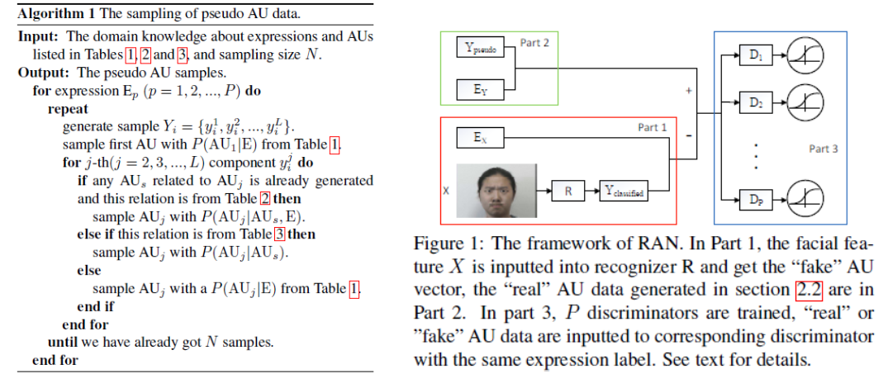

# A Reimplementation of Recognition Adversary Network (RAN)

<p align="left">
	
	
	
	
</p>

A PyTorch reimplementation of [Weakly Supervised Facial Action Unit Recognition through Adversarial Training](http://openaccess.thecvf.com/content_cvpr_2018/html/Peng_Weakly_Supervised_Facial_CVPR_2018_paper.html)



**Please note that this project is *NOT* the official implementation. It is a replicate only for learning, and I cannot guarantee its correctness. Kindly refer to the [Differences and Existing Problems](https://github.com/donydchen/ran_replicate#differences-and-existing-problems) below before using this project or making contact with me. Thanks**


## Getting Started

### Requirements

* Python 3
* PyTorch 0.4.1
* visdom (optional, only for training with browser visualizer)

### Installation

```
git clone https://github.com/donydchen/ran_replicate.git
cd ran_replicate
```

### Preprocess

#### Generate Pseudo AU Vectors

```sh
python tools/gen_pseudo_au.py
```

#### Preprocess CK+ dataset 

* Download [CK+](http://www.pitt.edu/~emotion/ck-spread.htm) dataset, and put it under `datasets/CKPlus`

```sh
python tools/preprocess_ckplus.py

# this script will parse image path and label, create train and test list, detect and align faces, etc.
```

#### Extract AU Vectors (if applicable)

* CK+ provides AU labels, however, in this project, AU vectors are extracted using [OpenFace](https://github.com/TadasBaltrusaitis/OpenFace).

```sh
python tools/extract_au.py

# note that you need to build and install OpenFace first.
```

### Train 

```sh
python main.py --data_root datasets/CKPlus --which_model_netR resnet18 --backend_pretrain --gpu_ids 0 --gan_type wgan-gp --load_size 250 --final_size 224 --visdom_env resnet18_wgan_fold1 --train_csv train_ids_1.csv --test_csv test_ids_1.csv
```

### Test 

```sh
python main.py --mode test --data_root datasets/CKPlus --gpu_ids 0 --ckpt_dir ckpts/CKPlus/resnet18/fold_1/190423_105211 --load_epoch 300 --which_model_netR resnet18 --load_size 250 --final_size 224 --test_csv test_ids_1.csv
```

## Results

Five-fold subject-independent corss-validation on CK+.

| AU   | F1 Score |
|------|----------|
| AU01 | 0.463703 |
| AU02 | 0.605515 |
| AU04 | 0.684670 |
| AU05 | 0.623919 |
| AU06 | 0.513861 |
| AU07 | 0.379647 |
| AU09 | 0.529395 |
| AU12 | 0.629960 |
| AU17 | 0.728096 |
| AU23 | 0.632099 |
| AU25 | 0.367475 |
| **Avg**| 0.559849 |

## Differences and Existing Problems

* Face landmarks are detected using MTCNN insstead of IntraFace.
* The recognition model is set to the resnet18 instead of a linear function. Sorry but using a linear function can't converge in my case.
* The GAN loss is set to WGAN-GP instead of vanilla one.
* Only experiments related to weakly-supervise and CK+ are implemented. 
* The pseudo AU generation function may contain some logical bugs due to the ambiguity of tables of AU relation (Table 1, 2 and 3 in the original paper).
* This project does **NOT** achieve the same state-of-the-art results as illustrated in the original paper. And please do **NOT** use it for comparison. 

## Pull Request 

You are always welcome to contribute to this repository by sending a [pull request](https://help.github.com/articles/about-pull-requests/).